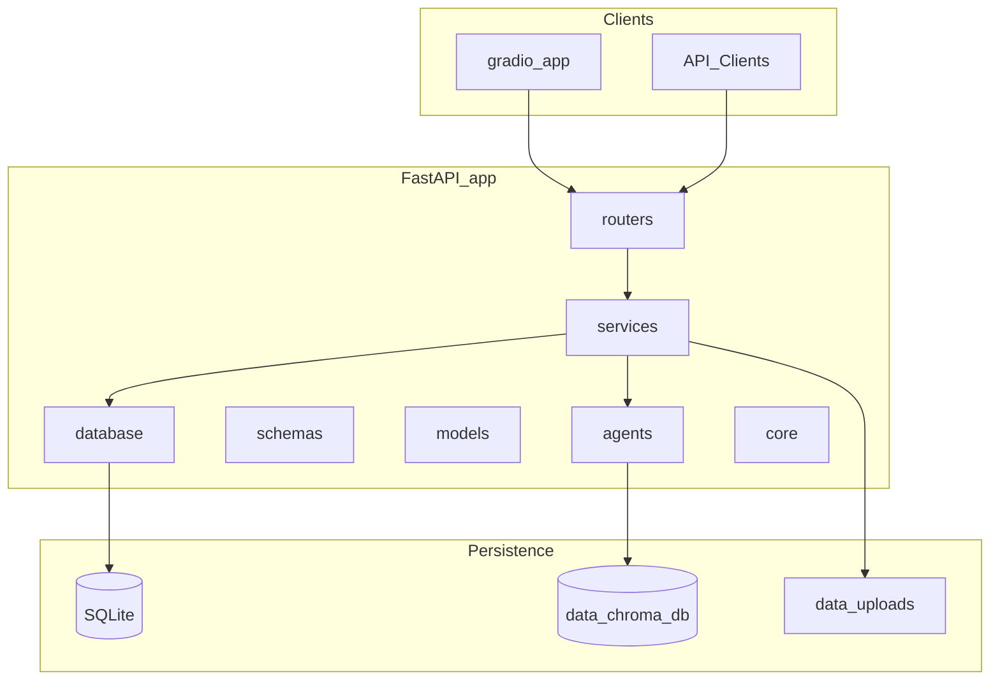

# ResearchPilot

ResearchPilot is a production-grade generative AI project for research assistance. It combines a FastAPI backend, a Gradio UI, retrieval-augmented generation (RAG), and multi-agent orchestration to help users explore and synthesize information from uploaded documents.

This repository is currently in **Phase 5** — document chunks are embedded and indexed in ChromaDB; semantic retrieval is available via `POST /retrieve`. LLM answer generation and RAG prompting are not implemented yet.

## Proposed Architecture

ResearchPilot follows a layered architecture that separates HTTP routing, business logic, AI agents, and persistence:



| Layer | Responsibility |
|-------|----------------|
| `app/routers/` | HTTP route definitions |
| `app/services/` | Business logic orchestration |
| `app/agents/` | LangGraph agent workflows |
| `app/schemas/` | Pydantic request/response models |
| `app/models/` | SQLAlchemy ORM models |
| `app/database/` | Database session and migration setup |
| `app/core/` | Configuration, dependencies, security |
| `app/utils/` | Shared helpers |
| `gradio_app/` | Standalone Gradio UI entry point |
| `data/uploads/` | Uploaded document storage |
| `data/chroma_db/` | ChromaDB vector index persistence |

## Development Roadmap

| Phase | Focus |
|-------|-------|
| **1** | Repository scaffolding |
| **2** | FastAPI + Gradio integration |
| **3** | SQLAlchemy setup and document/conversation metadata persistence |
| **4** | PDF ingestion pipeline and chunk storage |
| **5** | Baseline RAG implementation without LangGraph |
| **6** | Conversation memory |
| **7** | LangGraph multi-agent orchestration |
| **8** | Streaming responses, logging, and observability |
| **9** | Dockerization and deployment preparation |
| **10** | Testing, CI/CD, and documentation improvements |

## Getting Started

### Prerequisites

- Python 3.11+
- pip

### Installation

```bash
python -m venv .venv

# Windows
.venv\Scripts\activate

# macOS / Linux
source .venv/bin/activate

pip install -r requirements.txt

# Optional: development dependencies
pip install -r requirements-dev.txt
```

### Environment Variables

Copy the environment template and fill in your values:

```bash
copy .env.example .env   # Windows
# cp .env.example .env   # macOS / Linux
```

Set environment variables in your shell before starting the apps (or use a tool that loads `.env` into the process environment).

| Variable | Used by | Default | Description |
|----------|---------|---------|-------------|
| `FASTAPI_BASE_URL` | Gradio | `http://127.0.0.1:8000` | Base URL of the running FastAPI server |
| `CHUNK_SIZE` | Ingestion | `1000` | Maximum characters per text chunk |
| `CHUNK_OVERLAP` | Ingestion | `200` | Overlapping characters between consecutive chunks |
| `EMBEDDING_PROVIDER` | Embeddings | `openai` | Embedding backend (`openai` for production; `test` for pytest) |
| `OPENAI_EMBEDDING_MODEL` | Embeddings | `text-embedding-3-small` | OpenAI embedding model name |
| `CHROMA_COLLECTION_NAME` | ChromaDB | `researchpilot_chunks` | Chroma collection for chunk vectors |
| `RETRIEVAL_TOP_K` | Retrieval | `5` | Default number of chunks returned by `POST /retrieve` |
| `OPENAI_API_KEY` | Embeddings | — | Required when `EMBEDDING_PROVIDER=openai` |
| `GEMINI_API_KEY` | Future phases | — | Google Gemini API key placeholder |

Example for a non-default API host or port:

```bash
# Windows PowerShell
$env:FASTAPI_BASE_URL = "http://127.0.0.1:8000"

# macOS / Linux
export FASTAPI_BASE_URL=http://127.0.0.1:8000
```

### Running FastAPI

Start the API **first** — Gradio depends on it for the integration test.

From the project root:

```bash
uvicorn app.main:app --reload
```

The server listens at [http://127.0.0.1:8000](http://127.0.0.1:8000).

Verify the health endpoint:

```bash
curl http://127.0.0.1:8000/health
```

Expected response:

```json
{
  "status": "healthy",
  "project": "ResearchPilot"
}
```

Verify the hello endpoint:

```bash
curl "http://127.0.0.1:8000/hello?name=Roshan"
```

Expected response:

```json
{
  "message": "Hello Roshan, welcome to ResearchPilot."
}
```

Interactive API docs are available at [http://127.0.0.1:8000/docs](http://127.0.0.1:8000/docs).

### Running Gradio

In a **second terminal**, from the project root:

```bash
python gradio_app/app.py
```

Open the URL printed in the terminal (default: [http://127.0.0.1:7860](http://127.0.0.1:7860)).

Gradio does not embed FastAPI — it sends HTTP requests to the API process using `FASTAPI_BASE_URL` (see [Environment Variables](#environment-variables)). Ensure FastAPI is running before testing the connection.

### Testing the Integration

Use two terminals so FastAPI and Gradio stay separate processes:

| Terminal | Command |
|----------|---------|
| 1 | `uvicorn app.main:app --reload` |
| 2 | `python gradio_app/app.py` |

**Verification flow:**

```
Gradio UI
    ↓
User enters name (e.g. Roshan)
    ↓
Click "Test FastAPI Connection"
    ↓
HTTP GET http://127.0.0.1:8000/hello?name=Roshan
    ↓
FastAPI returns JSON
    ↓
Gradio displays: "Hello Roshan, welcome to ResearchPilot."
```

**Steps:**

1. Start FastAPI in terminal 1 and confirm `/health` returns `"status": "healthy"`.
2. Start Gradio in terminal 2 and open the local URL in your browser.
3. Enter a name in **Enter your name**.
4. Click **Test FastAPI Connection**.
5. Confirm the **Response** textbox shows `Hello <name>, welcome to ResearchPilot.`

**Optional API-only check (without Gradio):**

```bash
curl "http://127.0.0.1:8000/hello?name=Roshan"
```

**Troubleshooting:**

- If Gradio shows a connection error, ensure FastAPI is running and reachable at `FASTAPI_BASE_URL` (default: `http://127.0.0.1:8000`).
- If you changed the API host or port, set `FASTAPI_BASE_URL` to match before starting Gradio.

## Persistence (Phase 3)

ResearchPilot uses **SQLAlchemy** with **SQLite** for development persistence. Metadata is stored in a local database file so document records and conversation history survive API restarts.

| Item | Location |
|------|----------|
| Database file | `data/researchpilot.db` |
| Engine config | `app/database/session.py` |
| ORM models | `app/models/` |
| API schemas | `app/schemas/` |
| HTTP routes | `app/routers/documents.py`, `app/routers/conversations.py` |

Tables are created automatically when FastAPI starts (`init_db()` runs on application startup). The SQLite file is git-ignored; only the `data/` directory structure is tracked.

### Inspecting the Database

Using the SQLite CLI from the project root:

```bash
sqlite3 data/researchpilot.db
```

Useful commands inside the SQLite prompt:

```sql
.tables
.schema documents
.schema conversations
SELECT * FROM documents;
SELECT * FROM conversations;
.quit
```

On Windows, install [SQLite tools](https://www.sqlite.org/download.html) or use a GUI such as DB Browser for SQLite.

### Example API Requests

**Create a document record:**

```bash
curl -X POST http://127.0.0.1:8000/documents \
  -H "Content-Type: application/json" \
  -d "{\"filename\": \"paper.pdf\"}"
```

**List documents:**

```bash
curl http://127.0.0.1:8000/documents
```

**Create a conversation record:**

```bash
curl -X POST http://127.0.0.1:8000/conversations \
  -H "Content-Type: application/json" \
  -d "{\"query\": \"What is RAG?\", \"response\": \"RAG combines retrieval with generation.\"}"
```

**List conversations:**

```bash
curl http://127.0.0.1:8000/conversations
```

### Verify with Swagger UI

1. Start FastAPI: `uvicorn app.main:app --reload`
2. Open [http://127.0.0.1:8000/docs](http://127.0.0.1:8000/docs)
3. Under **Documents**, expand `POST /documents` → **Try it out** → set body to `{"filename": "paper.pdf"}` → **Execute** → confirm `201` and a JSON response with `id`, `filename`, and `uploaded_at`
4. Expand `GET /documents` → **Execute** → confirm the created document appears in the list
5. Under **Conversations**, expand `POST /conversations` → **Try it out** → set body to `{"query": "What is RAG?", "response": "RAG combines retrieval with generation."}` → **Execute** → confirm `201`
6. Expand `GET /conversations` → **Execute** → confirm the conversation appears
7. Restart the API and repeat `GET /documents` and `GET /conversations` to confirm data persists across restarts
8. Optionally run `sqlite3 data/researchpilot.db "SELECT * FROM documents;"` to inspect rows directly

## Document Ingestion (Phase 4)

Phase 4 transforms uploaded PDFs into structured, metadata-rich text chunks stored in SQLite. This prepares ResearchPilot for embedding generation and retrieval in Phase 5 without implementing vector search yet.

### Upload Workflow

```
Upload PDF (POST /documents/upload)
    ↓
File saved to data/uploads/{document_id}_{filename}
    ↓
PyPDFLoader extracts LangChain Documents (one per page)
    ↓
RecursiveCharacterTextSplitter creates smaller chunks
    ↓
Chunks persisted in SQLite (chunks table)
    ↓
Chunks retrievable via GET /documents/{document_id}/chunks
```

| Step | Component | Location |
|------|-----------|----------|
| HTTP upload | `POST /documents/upload` | `app/routers/documents.py` |
| File storage | Saved PDFs | `data/uploads/` |
| Loading | `PyPDFLoader` | `app/services/ingestion.py` |
| Chunking | `RecursiveCharacterTextSplitter` | `app/services/ingestion.py` |
| Persistence | `Document` → `Chunk` (one-to-many) | `app/models/` |

### Chunking Strategy

`RecursiveCharacterTextSplitter` breaks page-level text into smaller fragments using a hierarchy of separators (paragraph breaks, line breaks, sentences, words). This keeps chunks semantically coherent rather than splitting at arbitrary character positions.

| Setting | Default | Purpose |
|---------|---------|---------|
| `CHUNK_SIZE` | `1000` | Target maximum characters per chunk |
| `CHUNK_OVERLAP` | `200` | Shared characters between adjacent chunks to preserve context at boundaries |

Both values are configurable via environment variables (see [Environment Variables](#environment-variables)).

### Why Metadata Preservation Matters

Each LangChain `Document` carries `page_content` plus a `metadata` dictionary. `PyPDFLoader` populates:

- **`source`** — file path on disk
- **`page`** — zero-based page index

ResearchPilot adds **`source_filename`** during loading and maps metadata into the `Chunk` model:

| Chunk field | Source |
|-------------|--------|
| `chunk_text` | LangChain `page_content` |
| `page_number` | Loader `page` metadata (stored as 1-based) |
| `chunk_order` | Sequential index after splitting |
| `document_id` | Foreign key to parent `Document` |

Preserving page numbers and source filenames enables **citations** in future RAG responses (e.g. "See page 3 of paper.pdf") and ensures embeddings in Phase 5 can be traced back to their origin.

### Why LangChain Documents?

LangChain `Document` objects are the standard interchange format across loaders, splitters, embedders, and retrievers. By ingesting PDFs into Documents and splitting them with LangChain splitters, ResearchPilot stays compatible with the ecosystem used in Phase 5 (embeddings + retrieval) without re-parsing PDFs or inventing a parallel data model.

### Why Embeddings Are Deferred to Phase 5

Phase 4 focuses on **correct ingestion and chunk storage**. Embeddings require model selection, API keys, and vector index management — concerns that belong in the retrieval layer. Storing clean, metadata-rich chunks now means Phase 5 can embed and index them without revisiting the ingestion pipeline.

### Example API Requests

**Upload a PDF:**

```bash
curl -X POST http://127.0.0.1:8000/documents/upload \
  -F "file=@paper.pdf"
```

Expected response:

```json
{
  "id": 1,
  "filename": "paper.pdf",
  "uploaded_at": "2026-06-14T12:00:00",
  "chunk_count": 42
}
```

**List chunks for a document:**

```bash
curl http://127.0.0.1:8000/documents/1/chunks
```

**Inspect chunks in SQLite:**

```sql
SELECT id, document_id, page_number, chunk_order, substr(chunk_text, 1, 80)
FROM chunks
WHERE document_id = 1
ORDER BY chunk_order;
```

### Verify with Swagger UI (Phase 4)

1. Start FastAPI: `uvicorn app.main:app --reload`
2. Open [http://127.0.0.1:8000/docs](http://127.0.0.1:8000/docs)
3. Under **Documents**, expand `POST /documents/upload` → **Try it out**
4. Click **Choose File**, select a PDF, then **Execute**
5. Confirm `201` response with `id`, `filename`, `uploaded_at`, and `chunk_count`
6. Expand `GET /documents/{document_id}/chunks` → enter the `id` from step 5 → **Execute**
7. Confirm a JSON array of chunks with `chunk_text`, `page_number`, and `chunk_order`
8. Verify the file exists under `data/uploads/` and rows appear in SQLite:

```bash
sqlite3 data/researchpilot.db "SELECT COUNT(*) FROM chunks WHERE document_id = 1;"
```

## Semantic Retrieval (Phase 5)

Phase 5 adds **embeddings** and **vector similarity search** so ResearchPilot can find the most relevant document chunks for a natural-language query — without generating LLM answers yet.

### What Are Embeddings?

An **embedding** is a dense numerical vector that represents the semantic meaning of text. Similar concepts produce vectors that are close together in vector space, even when the exact words differ. ResearchPilot generates embeddings for each chunk during upload and for each query at retrieval time.

### Why Vector Databases?

SQLite excels at structured relational data (documents, chunks, conversations) but is not optimized for similarity search across high-dimensional vectors. **ChromaDB** stores embeddings and finds nearest neighbors efficiently using approximate nearest-neighbor indexes (HNSW).

### SQLite vs ChromaDB

| Store | Role | Contents |
|-------|------|----------|
| **SQLite** (`data/researchpilot.db`) | Source of truth for metadata | Documents, chunk text, page numbers, timestamps |
| **ChromaDB** (`data/chroma_db/`) | Vector index | Embeddings + retrieval metadata (`chunk_id`, `document_id`, `page_number`, `source_filename`) |

Each Chroma entry uses the SQLite `chunk.id` as its vector id, maintaining a direct mapping between stores.

### End-to-End Workflow

```
Upload PDF (POST /documents/upload)
    ↓
Chunks saved in SQLite (Phase 4)
    ↓
Embeddings generated (OpenAI by default)
    ↓
Vectors stored in ChromaDB with metadata
    ↓
POST /retrieve { "query": "..." }
    ↓
Query embedded → similarity search → top-k chunks returned
```

### How Retrieval Works

1. The query text is embedded using the configured provider.
2. ChromaDB performs cosine similarity search against indexed chunk vectors.
3. Top-k matches are joined with SQLite for authoritative `chunk_text` and document metadata.
4. Results include a `similarity_score` (1.0 = identical direction, lower = less similar).

### Embedding Provider Design

`app/services/embedding_service.py` exposes a factory (`get_embedding_model`) that returns a LangChain `Embeddings` instance based on `EMBEDDING_PROVIDER`:

| Provider | Status | Integration path |
|----------|--------|------------------|
| `openai` | Supported | `OpenAIEmbeddings` via `langchain-openai` |
| `gemini` | Future | `GoogleGenerativeAIEmbeddings` from `langchain-google-genai` |
| `ollama` | Future | `OllamaEmbeddings` from `langchain-ollama` |
| `huggingface` | Future | `HuggingFaceEmbeddings` from `langchain-huggingface` |

Swapping providers requires a new factory branch and the corresponding LangChain integration package — ingestion and retrieval code stay unchanged.

### Why LLM Generation Is Deferred to Phase 6

Phase 5 delivers **retrieval only**: finding relevant chunks. Phase 6 will add conversation memory and answer synthesis by passing retrieved context to an LLM. Separating retrieval from generation keeps each phase testable and avoids premature prompt engineering.

### Example API Requests

**Retrieve relevant chunks:**

```bash
curl -X POST http://127.0.0.1:8000/retrieve \
  -H "Content-Type: application/json" \
  -d "{\"query\": \"What is positional encoding?\"}"
```

Expected response:

```json
[
  {
    "chunk_id": 17,
    "document_id": 2,
    "page_number": 7,
    "source_filename": "attention.pdf",
    "similarity_score": 0.92,
    "chunk_text": "Positional encoding injects order information..."
  }
]
```

### Verify with Swagger UI (Phase 5)

1. Set `OPENAI_API_KEY` in your environment (or use `EMBEDDING_PROVIDER=test` for offline testing).
2. Start FastAPI: `uvicorn app.main:app --reload`
3. Upload a PDF via `POST /documents/upload` and note the returned `id`
4. Optionally confirm chunks via `GET /documents/{document_id}/chunks`
5. Expand `POST /retrieve` → **Try it out** → set body to `{"query": "What is positional encoding?"}` → **Execute**
6. Confirm a JSON array of matching chunks with `similarity_score` and metadata
7. Restart the API and repeat `POST /retrieve` to confirm ChromaDB persistence under `data/chroma_db/`

### Run Automated Tests

```bash
pip install -r requirements-dev.txt
pytest
```

Tests use `EMBEDDING_PROVIDER=test` with isolated temporary SQLite and ChromaDB directories. Coverage includes successful retrieval, multi-document ranking, empty-index retrieval, and Chroma persistence across client restarts.

## Project Structure

```
researchpilot/
├── app/
│   ├── __init__.py
│   ├── main.py
│   ├── routers/
│   │   ├── hello.py
│   │   ├── documents.py
│   │   ├── conversations.py
│   │   └── retrieve.py
│   ├── agents/
│   ├── core/
│   │   └── config.py
│   ├── services/
│   │   ├── ingestion.py
│   │   ├── embedding_service.py
│   │   ├── chroma_service.py
│   │   └── retrieval_service.py
│   ├── models/
│   │   ├── document.py
│   │   ├── chunk.py
│   │   └── conversation.py
│   ├── schemas/
│   │   ├── document.py
│   │   ├── chunk.py
│   │   ├── conversation.py
│   │   └── retrieve.py
│   ├── database/
│   │   ├── base.py
│   │   └── session.py
│   └── utils/
├── gradio_app/
│   └── app.py
├── data/
│   ├── researchpilot.db   # created at runtime (git-ignored)
│   ├── uploads/
│   └── chroma_db/
├── tests/
│   ├── conftest.py
│   ├── helpers.py
│   └── test_retrieval.py
├── requirements.txt
├── requirements-dev.txt
├── README.md
├── .gitignore
├── .env.example
└── Dockerfile
```

## License

TBD
