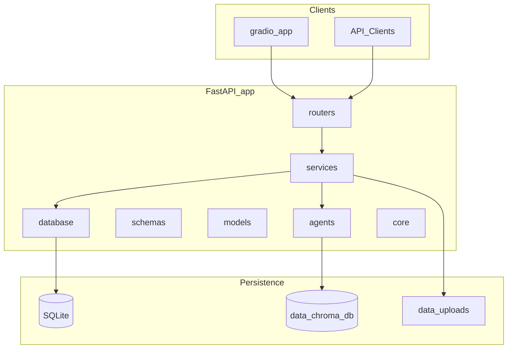

# ResearchPilot

ResearchPilot is a production-grade generative AI project for research assistance. It combines a FastAPI backend, a Gradio UI, retrieval-augmented generation (RAG), and multi-agent orchestration to help users explore and synthesize information from uploaded documents.

This repository is currently in **Phase 1** — repository scaffolding only. No business logic, RAG pipelines, agents, or database models are implemented yet.

## Proposed Architecture

ResearchPilot follows a layered architecture that separates HTTP routing, business logic, AI agents, and persistence:



| Layer | Responsibility |
|-------|----------------|
| `app/routers/` | HTTP route definitions |
| `app/services/` | Business logic orchestration |
| `app/agents/` | LangGraph agent workflows |
| `app/schemas/` | Pydantic request/response models |
| `app/models/` | SQLAlchemy ORM models |
| `app/database/` | Database session and migration setup |
| `app/core/` | Configuration, dependencies, security |
| `app/utils/` | Shared helpers |
| `gradio_app/` | Standalone Gradio UI entry point |
| `data/uploads/` | Uploaded document storage |
| `data/chroma_db/` | ChromaDB vector index persistence |

## Development Roadmap

| Phase | Focus |
|-------|-------|
| **1** | Repository scaffolding |
| **2** | FastAPI + Gradio integration |
| **3** | SQLAlchemy setup and document/conversation metadata persistence |
| **4** | PDF ingestion pipeline and ChromaDB indexing |
| **5** | Baseline RAG implementation without LangGraph |
| **6** | Conversation memory |
| **7** | LangGraph multi-agent orchestration |
| **8** | Streaming responses, logging, and observability |
| **9** | Dockerization and deployment preparation |
| **10** | Testing, CI/CD, and documentation improvements |

## Getting Started

### Prerequisites

- Python 3.11+
- pip

### Installation

```bash
python -m venv .venv

# Windows
.venv\Scripts\activate

# macOS / Linux
source .venv/bin/activate

pip install -r requirements.txt

# Optional: development dependencies
pip install -r requirements-dev.txt
```

Copy the environment template and fill in your API keys:

```bash
copy .env.example .env   # Windows
# cp .env.example .env   # macOS / Linux
```

### Running FastAPI

From the project root:

```bash
uvicorn app.main:app --reload
```

Verify the health endpoint:

```bash
curl http://127.0.0.1:8000/health
```

Expected response:

```json
{
  "status": "healthy",
  "project": "ResearchPilot"
}
```

Interactive API docs are available at [http://127.0.0.1:8000/docs](http://127.0.0.1:8000/docs).

### Running Gradio

From the project root:

```bash
python gradio_app/app.py
```

Open the URL printed in the terminal (default: [http://127.0.0.1:7860](http://127.0.0.1:7860)).

## Project Structure

```
researchpilot/
├── app/
│   ├── __init__.py
│   ├── main.py
│   ├── routers/
│   ├── agents/
│   ├── services/
│   ├── models/
│   ├── schemas/
│   ├── database/
│   ├── core/
│   └── utils/
├── gradio_app/
│   └── app.py
├── data/
│   ├── uploads/
│   └── chroma_db/
├── tests/
├── requirements.txt
├── requirements-dev.txt
├── README.md
├── .gitignore
├── .env.example
└── Dockerfile
```

## License

TBD
