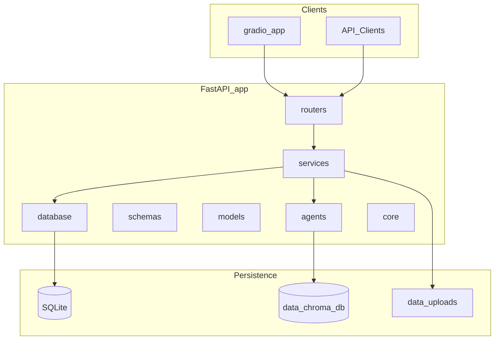

# ResearchPilot

ResearchPilot is a production-grade generative AI project for research assistance. It combines a FastAPI backend, a Gradio UI, retrieval-augmented generation (RAG), and multi-agent orchestration to help users explore and synthesize information from uploaded documents.

This repository is currently in **Phase 2** — FastAPI and Gradio run as separate processes and communicate over HTTP. RAG pipelines, agents, and database models are not implemented yet.

## Proposed Architecture

ResearchPilot follows a layered architecture that separates HTTP routing, business logic, AI agents, and persistence:



| Layer | Responsibility |
|-------|----------------|
| `app/routers/` | HTTP route definitions |
| `app/services/` | Business logic orchestration |
| `app/agents/` | LangGraph agent workflows |
| `app/schemas/` | Pydantic request/response models |
| `app/models/` | SQLAlchemy ORM models |
| `app/database/` | Database session and migration setup |
| `app/core/` | Configuration, dependencies, security |
| `app/utils/` | Shared helpers |
| `gradio_app/` | Standalone Gradio UI entry point |
| `data/uploads/` | Uploaded document storage |
| `data/chroma_db/` | ChromaDB vector index persistence |

## Development Roadmap

| Phase | Focus |
|-------|-------|
| **1** | Repository scaffolding |
| **2** | FastAPI + Gradio integration |
| **3** | SQLAlchemy setup and document/conversation metadata persistence |
| **4** | PDF ingestion pipeline and ChromaDB indexing |
| **5** | Baseline RAG implementation without LangGraph |
| **6** | Conversation memory |
| **7** | LangGraph multi-agent orchestration |
| **8** | Streaming responses, logging, and observability |
| **9** | Dockerization and deployment preparation |
| **10** | Testing, CI/CD, and documentation improvements |

## Getting Started

### Prerequisites

- Python 3.11+
- pip

### Installation

```bash
python -m venv .venv

# Windows
.venv\Scripts\activate

# macOS / Linux
source .venv/bin/activate

pip install -r requirements.txt

# Optional: development dependencies
pip install -r requirements-dev.txt
```

### Environment Variables

Copy the environment template and fill in your values:

```bash
copy .env.example .env   # Windows
# cp .env.example .env   # macOS / Linux
```

Set environment variables in your shell before starting the apps (or use a tool that loads `.env` into the process environment).

| Variable | Used by | Default | Description |
|----------|---------|---------|-------------|
| `FASTAPI_BASE_URL` | Gradio | `http://127.0.0.1:8000` | Base URL of the running FastAPI server |
| `OPENAI_API_KEY` | Future phases | — | OpenAI API key placeholder |
| `GEMINI_API_KEY` | Future phases | — | Google Gemini API key placeholder |

Example for a non-default API host or port:

```bash
# Windows PowerShell
$env:FASTAPI_BASE_URL = "http://127.0.0.1:8000"

# macOS / Linux
export FASTAPI_BASE_URL=http://127.0.0.1:8000
```

### Running FastAPI

Start the API **first** — Gradio depends on it for the integration test.

From the project root:

```bash
uvicorn app.main:app --reload
```

The server listens at [http://127.0.0.1:8000](http://127.0.0.1:8000).

Verify the health endpoint:

```bash
curl http://127.0.0.1:8000/health
```

Expected response:

```json
{
  "status": "healthy",
  "project": "ResearchPilot"
}
```

Verify the hello endpoint:

```bash
curl "http://127.0.0.1:8000/hello?name=Roshan"
```

Expected response:

```json
{
  "message": "Hello Roshan, welcome to ResearchPilot."
}
```

Interactive API docs are available at [http://127.0.0.1:8000/docs](http://127.0.0.1:8000/docs).

### Running Gradio

In a **second terminal**, from the project root:

```bash
python gradio_app/app.py
```

Open the URL printed in the terminal (default: [http://127.0.0.1:7860](http://127.0.0.1:7860)).

Gradio does not embed FastAPI — it sends HTTP requests to the API process using `FASTAPI_BASE_URL` (see [Environment Variables](#environment-variables)). Ensure FastAPI is running before testing the connection.

### Testing the Integration

Use two terminals so FastAPI and Gradio stay separate processes:

| Terminal | Command |
|----------|---------|
| 1 | `uvicorn app.main:app --reload` |
| 2 | `python gradio_app/app.py` |

**Verification flow:**

```
Gradio UI
    ↓
User enters name (e.g. Roshan)
    ↓
Click "Test FastAPI Connection"
    ↓
HTTP GET http://127.0.0.1:8000/hello?name=Roshan
    ↓
FastAPI returns JSON
    ↓
Gradio displays: "Hello Roshan, welcome to ResearchPilot."
```

**Steps:**

1. Start FastAPI in terminal 1 and confirm `/health` returns `"status": "healthy"`.
2. Start Gradio in terminal 2 and open the local URL in your browser.
3. Enter a name in **Enter your name**.
4. Click **Test FastAPI Connection**.
5. Confirm the **Response** textbox shows `Hello <name>, welcome to ResearchPilot.`

**Optional API-only check (without Gradio):**

```bash
curl "http://127.0.0.1:8000/hello?name=Roshan"
```

**Troubleshooting:**

- If Gradio shows a connection error, ensure FastAPI is running and reachable at `FASTAPI_BASE_URL` (default: `http://127.0.0.1:8000`).
- If you changed the API host or port, set `FASTAPI_BASE_URL` to match before starting Gradio.

## Project Structure

```
researchpilot/
├── app/
│   ├── __init__.py
│   ├── main.py
│   ├── routers/
│   │   └── hello.py
│   ├── agents/
│   ├── services/
│   ├── models/
│   ├── schemas/
│   ├── database/
│   ├── core/
│   └── utils/
├── gradio_app/
│   └── app.py
├── data/
│   ├── uploads/
│   └── chroma_db/
├── tests/
├── requirements.txt
├── requirements-dev.txt
├── README.md
├── .gitignore
├── .env.example
└── Dockerfile
```

## License

TBD
